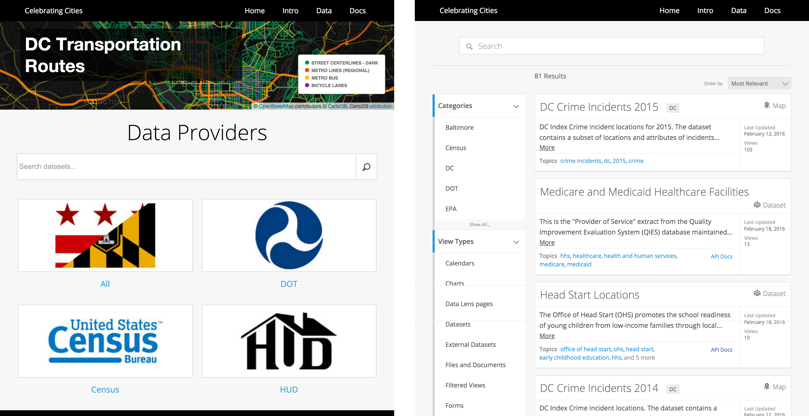
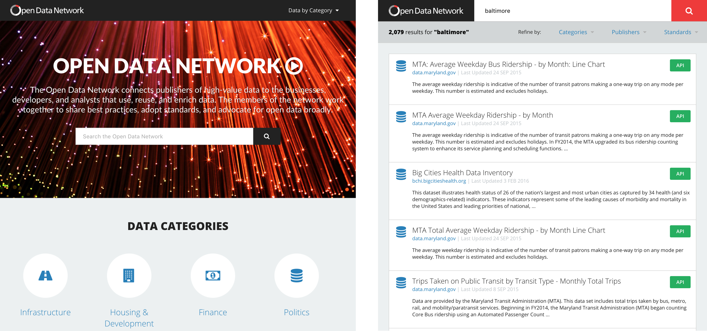
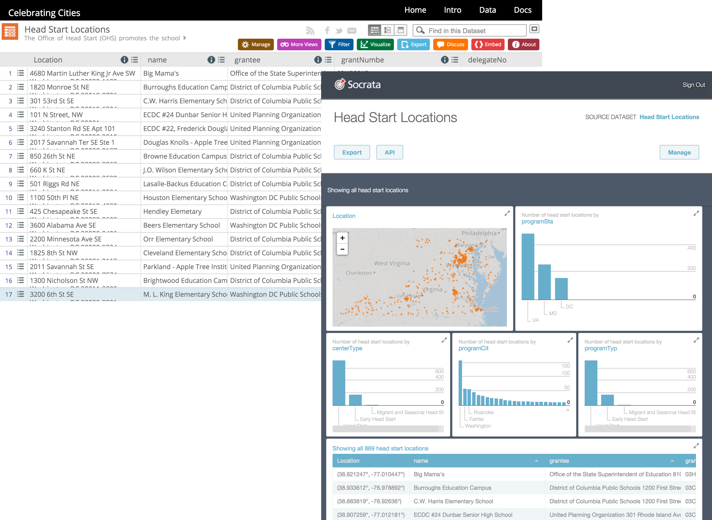

## Socrata Open Data APIs
#### Celebrating Cities | Hack the Last Mile

===

# Who the heck are you?

---

## We build _software_ to make data _more useful_ to _more people_

<!-- https://www.flickr.com/photos/hyku/2497370097 -->
--- 

<h2>We believe that _greater access_ to _public data_ makes the world a _better place to live_</h2>

---

<h2>We make it _easy_ for _governments and non-profits_ to share their public data with _developers_</h2>

===

# The Socrata Open Data APIs

---

## Finding Data

### [celebratingcities.data.socrata.com](https://celebratingcities.data.socrata.com/)

---

## Finding More Data

### [opendatanetwork.com](https://www.opendatanetwork.com/)

---

### Getting to the good stuff (data)

---

### Getting to the better stuff (APIs)

---

## API Endpoints

 
<code style='font-size:120%;'>https://$domain/resource/$identifier.$ext</code>

 

<em>Where:</em>

- <code>$domain</code> is the publisher's domain (ex: <code>celebratingcities.data.socrata.com</code>)
- <code>$identifier</code> is a dataset's unique ID (ex: <code>8qxj-ircv</code>)
- <code>$ext</code> is <code>json</code>, <code>geojson</code>, <code>csv</code>, <code>xml</code>, or <code>rdf</code>

---

### Example: Tobacco Legislation by State

<a target='blank' style='color:#FFF !important' href='https://chronicdata.cdc.gov/resource/ag3f-urcg.json'><code style=''>https://chronicdata.cdc.gov/resource/ag3f-urcg.json</code></a>

<pre>
  <code data-trim contenteditable class="javascript">
[
  { // first result
    "locationabbr": "AL",
    "locationdesc": "Alabama",
    "provisiondesc": "Minimum Penalty ($)",
    "measuredesc": "Bars",
    "provisiongroupdesc": "Penalties",
    "provisionvalue": "No Provision",
    "provisionaltvalue": "0",
    "geolocation": {
      "type": "Point",
      "coordinates": [
        -83.62758034599966,
        32.83968109300048
      ]
    },
    "provisiongroupid": "60GRP",
    "year": "2015",
    "quarter": "1"
  }, // ... more results ...
]
  </code>
</pre>

---

## Simple Filters

<a target='blank' style='color:#FFF !important' href='https://chronicdata.cdc.gov/resource/ag3f-urcg.json?locationabbr=GA&year=2015&measuredesc=Bars'><code style=''>https://chronicdata.cdc.gov/resource/ag3f-urcg.json
 ?locationabbr=GA&year=2015&measuredesc=bars
</code></a>

<pre><code data-trim contenteditable class="javascript">
[
  {
    "datatype": "Yes/No",
    "provisionvalue": "Yes",
    "effective_date": "2005-07-01T00:00:00.000",
    "enacted_date": "2005-05-09T00:00:00.000",
    "citation": "GA. CODE ANN. § 31-12A-10",
    "geolocation": {
      "type": "Point",
      "coordinates": [
        -83.62758034599966,
        32.83968109300048
      ]
    },
    "locationabbr": "GA",
    "locationdesc": "Georgia",
    "measuredesc": "Bars",
    "year": "2015"
    "quarter": "1"
  }, // ... more results ...
]
</code></pre>

---

## SoQL Queries

<code>
/resource/ag3f-urcg.json? 
$where=enacted_date
 between '2015-01-01T00:00:00.000'
 and '2016-01-01T00:00:00.000'
</code>

<small style="padding-top: 5em">For more details see <a href="http://dev.socrata.com">dev.socrata.com</a></small>

---

## Aggregating Data

<a target='blank' style='color:#FFF !important' href='https://chronicdata.cdc.gov/resource/ag3f-urcg.json?year=2015&provisiondesc=Maximum%20Penalty%20($)&$select=locationabbr,max(provisionaltvalue)&$group=locationabbr&$order=max_provisionaltvalue%20desc'><code style=''>https://chronicdata.cdc.gov/resource/ag3f-urcg.json
 ?year=2015&provisiondesc=Maximum Penalty ($)
 
&$select=locationabbr,max(provisionaltvalue)
 
&$group=locationabbr&$order=max_provisionaltvalue desc
</code></a>

<pre><code data-trim contenteditable class="javascript">
[
  {
    "locationabbr": "NY",
    "max_provisionaltvalue": "2000"
  },
  {
    "locationabbr": "ME",
    "max_provisionaltvalue": "1500"
  },
  {
    "locationabbr": "ND",
    "max_provisionaltvalue": "1500"
  }, // ... snip ...
  {
    "locationabbr": "GA",
    "max_provisionaltvalue": "500"
  }, // ... snip ...
]
</code></pre>

---

## Paging Through Data

<code contenteditable>
/resource/abcd-1234.json? 
$limit=50 
&amp;$offset=100
</code>

---

## Application Tokens

1. Register at [http://dev.socrata.com/register](http://dev.socrata.com/register)
2. Include as:
  - `_X-App-Token_: _$token_` HTTP Header or ... 
  - The `_$$app_token_=_$token_` URL parameter
3. Profit!!! (from more API requests)

===

# Help!

---

## Developer Portal

# [dev.socrata.com](http://dev.socrata.com)

Community powered! Learn how to <a href="http://dev.socrata.com/contributing.html">contribute</a>.

---

## Libraries &amp; SDKs

### [dev.socrata.com/libraries/](http://dev.socrata.com/libraries/)

<a href="http://socrata.github.io/soda-ruby/">Ruby</a>, <a href="https://github.com/socrata/soda-scala">Scala</a>, <a href="http://socrata.github.io/soda-java/">Java</a>, <a href="https://github.com/socrata/soda-ios-sdk">ObjectiveC</a>, <a href="https://github.com/Chicago/RSocrata">R</a>, <a href="https://github.com/socrata/soda-swift">Swift</a>, etc.

--- 

## Getting Help

- Track me down!
- IRC: [chat.freenode.net/#socrata-soda](irc://chat.freenode.net/#socrata-soda)
- Stack Overflow: [soda](http://stackoverflow.com/questions/tagged/soda) or [socrata](http://stackoverflow.com/questions/tagged/socrata)

===

[thank-a-govie.com](http://thank-a-govie.com)

===

## One more thing...

<h1 class="fragment" data-fragment-index="0">We're hiring!</h1>

<h2 class="fragment" data-fragment-index="1"><a href="http://careers.socrata.com">careers.socrata.com</a></h2>

===

===

# Thanks!

